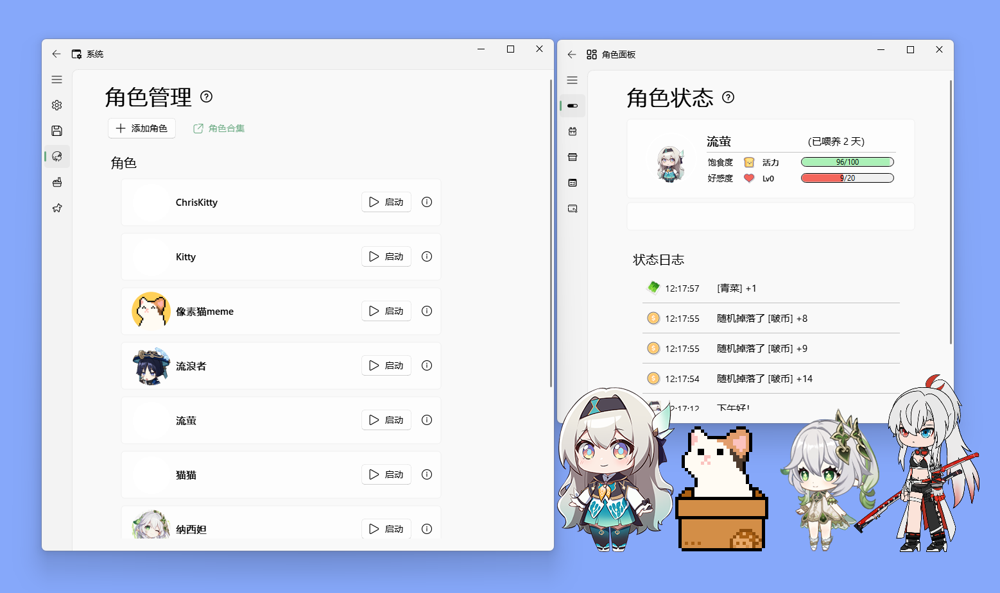

<h1 align="center">
  ClawPet | 爪宠物
</h1>

<p align="center">
  基于 PySide6 的桌面宠物开发框架
</p>

<p align="center">
  
  
</p>



---

## Fork 说明

本项目 fork 自 [ChaozhongLiu/DyberPet](https://github.com/ChaozhongLiu/DyberPet)，在 `feat/lite-version` 分支上进行开发。

## 轻量版本

这是一个**轻量版本**，移除了复杂的功能，保留核心体验：

- ~~HP/饱食度系统~~
- ~~物品/背包系统~~
- ~~Buff 增益系统~~
- ~~迷你宠物系统~~

保留核心功能：
- 桌面宠物显示与动画
- 鼠标交互（拖拽、点击、摸摸）
- 多宠物切换
- OpenClaw 深度集成

## OpenClaw 深度集成

本项目深度集成 [OpenClaw](https://github.com/st子神秘的OpenClaw仓库链接)，实现宠物与 LLM 的实时对话：

- **WebSocket 实时通信**：宠物通过 WebSocket 与 OpenClaw Gateway 保持连接
- **流式响应**：支持 AI 回复的流式输出，实时显示在对话气泡中
- **多角色端口管理**：每个宠物角色对应独立端口，可同时运行多个 AI 实例
- **聊天面板**：内置 Chat UI，支持与宠物进行自然语言对话
- **上下文记忆**：通过 OpenClaw 的 history 管理实现多轮对话

### OpenClaw 架构

```
┌─────────────────────────────────────────────────────────────┐
│                        ClawPet                              │
│  ┌─────────────┐    ┌──────────────┐    ┌─────────────┐  │
│  │  PetWidget  │◄──►│ Chat Panel   │◄──►│ OpenClaw    │  │
│  │  (桌面宠物)  │    │  (聊天面板)   │    │  Client     │  │
│  └─────────────┘    └──────────────┘    └──────┬──────┘  │
│         │                                       │          │
└─────────┼───────────────────────────────────────┼──────────┘
          │                                       ▼
          │              ┌──────────────────────────────┐
          │              │     OpenClaw Gateway        │
          │              │   (WebSocket Server)       │
          │              └──────────────┬───────────────┘
          │                             │
          ▼                             ▼
   ┌─────────────┐              ┌──────────────────┐
   │  对话气泡   │              │   LLM Provider   │
   │  显示AI回复 │              │   (GPT/Claude)  │
   └─────────────┘              └──────────────────┘
```

## 快速开始

### 环境要求

- Python 3.9+
- Conda 环境

### 安装依赖

```bash
conda create --name claw_pet python=3.9.18
conda activate claw_pet
conda install -c conda-forge apscheduler
pip install pynput==1.7.6
pip install PySide6-Fluent-Widgets==1.5.4 -i https://pypi.org/simple/
pip install pyside6==6.5.2
pip install tendo
pip install websocket-client
```

### 运行

```bash
python run_ClawPet.py
```

### 配置 OpenClaw

1. 在设置中启用 OpenClaw
2. 配置 OpenClaw Gateway 地址和端口
3. 设置认证 Token
4. 重启应用后即可与宠物对话

## 项目结构

```
ClawPet/
├── ClawPet/              # 核心包
│   ├── core/             # 核心模块
│   │   ├── pet_animation.py    # 动画模块
│   │   ├── pet_interaction.py  # 交互模块
│   │   ├── pet_scheduler.py    # 计划任务
│   │   ├── accessory.py       # 配件系统
│   │   └── notification.py    # 通知系统
│   ├── ClawSettings/     # 设置面板
│   │   ├── control_panel.py    # 主控制面板
│   │   ├── chat_ui.py         # 聊天界面
│   │   └── appearance_ui.py    # 外观设置
│   ├── OpenClawClient/   # OpenClaw 集成
│   │   ├── websocket_client.py  # WebSocket 客户端
│   │   ├── gateway_manager.py   # Gateway 端口管理
│   │   └── chat_history.py     # 聊天历史
│   ├── Dashboard/        # 仪表盘
│   ├── pet_widget.py     # 主宠物窗口
│   ├── config.py         # 配置
│   └── settings.py       # 设置
├── res/                  # 资源文件
│   └── role/             # 角色素材
├── docs/                 # 文档
└── run_ClawPet.py        # 入口
```

## 与原版 DyberPet 的差异

| 功能 | 原版 DyberPet | ClawPet (轻量版) |
|------|--------------|------------------|
| HP/饱食度 | ✓ | ✗ |
| 物品系统 | ✓ | ✗ |
| Buff系统 | ✓ | ✗ |
| 迷你宠物 | ✓ | ✗ |
| 商店 | ✓ | ✗ |
| 任务系统 | ✓ | ✗ |
| 桌面宠物核心 | ✓ | ✓ |
| 鼠标交互 | ✓ | ✓ |
| OpenClaw 集成 | ✗ | ✓ (深度) |

## 开发

### 素材开发

参考 [素材开发文档](docs/art_dev.md)

### 添加新角色

1. 在 `res/role/` 下创建角色文件夹
2. 配置 `pet_conf.json` 和 `act_conf.json`
3. 在应用中选择导入

## 相关文档

- [OpenClaw 集成设计](docs/OPENCLAW_INTEGRATION_DESIGN.md)
- [开发速查表](DEVELOPER_CHEATSHEET.md)
- [架构深度分析](ARCHITECTURE_DEEP_DIVE.md)
- [设计文档](DESIGN_DOCUMENT.md)

## License

MIT License
